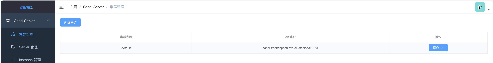
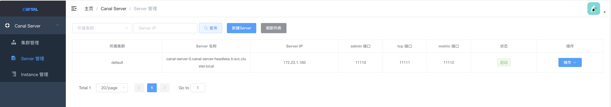

# helm charts 使用说明

包含`canal-admin`和`canal-server`两个chart，基本配置保存在k8s的`secret`里，`canal.properties`和`instance.properties`保存在mysql数据库中，使用zookeeper注册中心实现高可用。

- [helm charts 使用说明](#helm-charts-使用说明)
  - [创建zk集群](#创建zk集群)
  - [初始化数据库](#初始化数据库)
  - [部署canal-admin chart](#部署canal-admin-chart)
    - [配置values.yaml](#配置valuesyaml)
    - [配置集群信息](#配置集群信息)
  - [部署canal-server chart](#部署canal-server-chart)
    - [配置values.yaml](#配置valuesyaml-1)
  - [instance 实例创建](#instance-实例创建)

## 创建zk集群

```sh
helm install canal-zookeeper oci://registry-1.docker.io/bitnamicharts/zookeeper
```

如需挂载磁盘参考 [bitnami/zookeeper](`https://github.com/bitnami/charts/tree/main/bitnami/zookeeper`)


## 初始化数据库

[/admin/admin-web/src/main/resources/canal_manager.sql](/admin/admin-web/src/main/resources/canal_manager.sql)

[/deployer/src/main/resources/spring/tsdb/sql/create_table.sql](/deployer/src/main/resources/spring/tsdb/sql/create_table.sql)

## 部署canal-admin chart

### 配置values.yaml

```yaml
# 主要配置
admin:
  config: |
    server:
      port: 8089
    spring:
      jackson:
        date-format: yyyy-MM-dd HH:mm:ss
        time-zone: GMT+8
    spring.datasource:
      address: your_db_host:3306
      database: canal_manager
      username: ****
      password: ****
      driver-class-name: com.mysql.jdbc.Driver
      url: jdbc:mysql://${spring.datasource.address}/${spring.datasource.database}?useUnicode=true&characterEncoding=UTF-8&useSSL=false&allowPublicKeyRetrieval=true
      hikari:
        maximum-pool-size: 30
        minimum-idle: 1
    canal:
      adminUser: admin
      adminPasswd: admin
    # debug: true
```

全量参数见：[canal-admin/values.yaml](./canal-admin/values.yaml)，测试用例见：[tests/admin-values.yaml](./tests/admin-values.yaml)

```sh
helm install canal-admin -f ./admin-values.yaml ./canal-admin
```

### 配置集群信息



等待pod启动后，使用默认账户`admin`密码`123456`登录

创建集群`default`并配置`zk地址`为`canal-zookeeper.default.svc.cluster.local:2181`

配置完成后，点击`配置`-`主配置`，修改以下配置项，不是覆盖整个文件

```yaml
canal.user = admin
canal.passwd = 4ACFE3202A5FF5CF467898FC58AAB1D615029441

canal.zkServers = canal-zookeeper.default.svc.cluster.local:2181
# tcp, kafka, rocketMQ, rabbitMQ, pulsarMQ 看实际需求，此处改为了rabbitMQ
canal.serverMode = rabbitMQ

#canal.instance.tsdb.dir = ${canal.file.data.dir:../conf}/${canal.instance.destination:}
canal.instance.tsdb.url = jdbc:mysql://you_db_host:3306/canal_tsdb?useUnicode=true&characterEncoding=UTF-8&useSSL=false
canal.instance.tsdb.dbUsername = ****
canal.instance.tsdb.dbPassword = ****

#canal.instance.tsdb.spring.xml = classpath:spring/tsdb/h2-tsdb.xml
canal.instance.tsdb.spring.xml = classpath:spring/tsdb/mysql-tsdb.xml

#canal.instance.global.spring.xml = classpath:spring/file-instance.xml
canal.instance.global.spring.xml = classpath:spring/default-instance.xml

# 如果用的是阿里云polardb需要配置
canal.aliyun.accessKey = ****
canal.aliyun.secretKey = ****
canal.aliyun.uid = 主账号id

# 我们是推送到rabbitmq所以需要配置
rabbitmq.host = ****:5672
rabbitmq.virtual.host = ****
rabbitmq.exchange = ****
# canal.aliyun.accessKey
rabbitmq.username = ****
# canal.aliyun.secretKey
rabbitmq.password = ****
rabbitmq.deliveryMode = direct
```

## 部署canal-server chart

### 配置values.yaml

```yaml
# 主要配置
server:
  config: |
    canal.port = 11111
    canal.metrics.pull.port = 11112

    # register ip
    canal.register.ip =

    # canal admin config
    canal.admin.manager = canal-admin.default:8089
    canal.admin.port = 11110
    canal.admin.user = admin
    canal.admin.passwd = 4ACFE3202A5FF5CF467898FC58AAB1D615029441
    # admin auto register
    canal.admin.register.auto = true
    canal.admin.register.cluster = default
```

```sh
helm install canal-server -f ./server-values.yaml ./canal-server
```

全量参数见：[canal-server/values.yaml](./canal-server/values.yaml)，测试用例见：[tests/server-values.yaml](./tests/server-values.yaml)



至此，canal-server已自动创建，并自动注册。

## instance 实例创建

主要配置如下

```yaml
# 配置你要监听的数据库
canal.instance.master.address=127.0.0.1:3306
canal.instance.dbUsername=****
canal.instance.dbPassword=****

# 过滤监听哪些表
canal.instance.filter.regex=.*\\..*

# 如果是推送到rabbitmq，需要配置 Routing Key
canal.mq.topic=你的Routing Key
```
